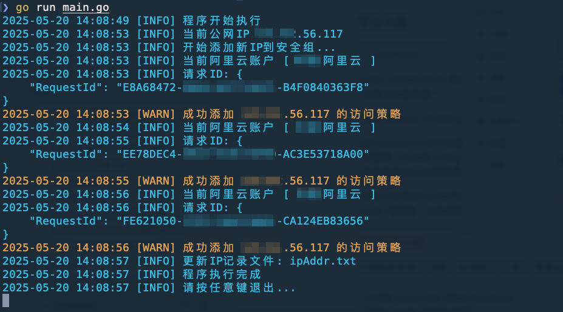
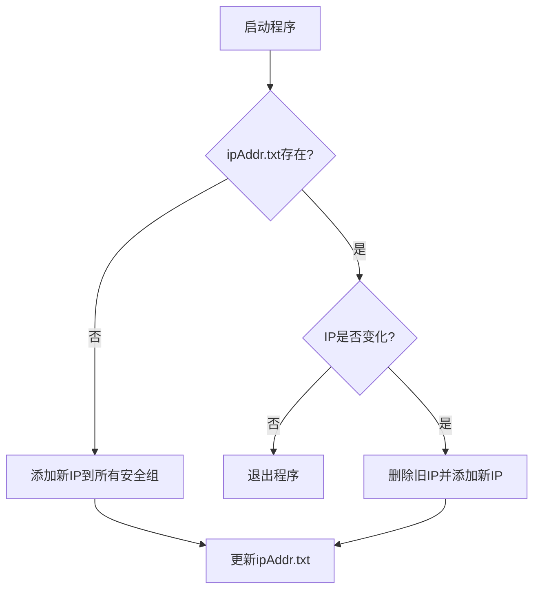

# 阿里云ECS动态白名单管理工具

> 自动化管理阿里云ECS安全组白名单，解决动态公网IP变更带来的运维痛点

## 🎯 功能特性

- **智能IP检测**
  自动获取当前公网IP，并与历史记录比对
- **全生命周期管理**
  ✅ 自动添加新IP
  ✅ 自动清理旧IP
  ✅ 支持多账号批量操作
- **精细化控制**
  - 可配置端口范围（单端口/范围）
  - 支持TCP/UDP协议选择
  - 允许/拒绝策略开关



## 📦 快速开始

### 前置要求

- 阿里云账号AK/SK（需`AliyunECSFullAccess`权限）
- Go 1.20+（仅源码编译需要）

### 安装方式

#### 二进制安装（推荐）

```bash
# Linux/macOS
wget https://github.com/WillemCode/AliCloud_Whitelist/releases/v1.0.0/download/aliyun-whitelist-linux-amd64 -O /usr/local/bin/aliyun-whitelist
chmod +x /usr/local/bin/aliyun-whitelist

# Windows
下载 aliyun-whitelist-windows-amd64.exe 执行
```

#### 源码编译

```bash
git clone https://github.com/WillemCode/AliCloud_Whitelist.git
cd AliCloud_Whitelist
go build -o aliyun-whitelist
```

## ⚙️ 配置说明

创建 `config.yaml` 配置文件：

```yaml
aliyun_accounts:
  - name: "生产环境"
    regionId: "cn-beijing"
    access_key: "AK_****"
    access_secret: "SK_****"
    policy: "accept"
    Port_Range: "22/22"       # SSH端口示例
    Ip_Protocol: "tcp"
    Security_GroupId: "sg-****"
  - name: "测试环境"
    regionId: "cn-hangzhou"
    access_key: "AK_****"
    access_secret: "SK_****"
    policy: "accept"
    Port_Range: "80/443"     # Web端口范围
    Ip_Protocol: "tcp"
    Security_GroupId: "sg-****"
```

## 🚀 使用指南

### 常规运行

```bash
./aliyun-whitelist
```

程序将：

1. 检测当前公网IP
2. 对比`ipAddr.txt`记录
3. 自动执行安全组规则更新

### 定时任务配置（推荐）

```bash
# 每小时检查一次（Linux crontab示例）
0 * * * * /usr/local/bin/aliyun-whitelist >> /var/log/whitelist.log 2>&1
```

## 🔍 工作流程



## 📜 最佳实践

1. **权限控制**：建议创建专有RAM账号，仅授予`AliyunECSFullAccess`权限
2. **日志监控**：建议配合`logrotate`管理日志文件
3. **高可用部署**：可在多台办公网络主机同时运行

## 🤝 参与贡献

欢迎提交Issue或PR：
1. 报告BUG请包含操作系统版本和错误日志
2. 新功能建议请描述使用场景

## 📜 开源协议

本项目采用 [GNU General Public License (GPL)](./LICENSE) 进行开源发布。  
这意味着：

- 你可以自由复制、修改和分发本项目的源代码，但修改后的项目也必须继续以 GPL 或兼容的许可证进行发布；
- 分发或发布时，需包含本项目的原始版权声明与 GPL 协议文本，并提供完整的源代码获取方式。

请参阅 [LICENSE](./LICENSE) 文件获取详细条款。若你对 GPL 的使用及合规性有任何疑问，请查阅 [GNU 官网](https://www.gnu.org/licenses/) 或咨询相关专业人士。

---

## Star History

[](https://www.star-history.com/#WillemCode/AliCloud_Domain&WillemCode/AliCloud_Whitelist&Date)
