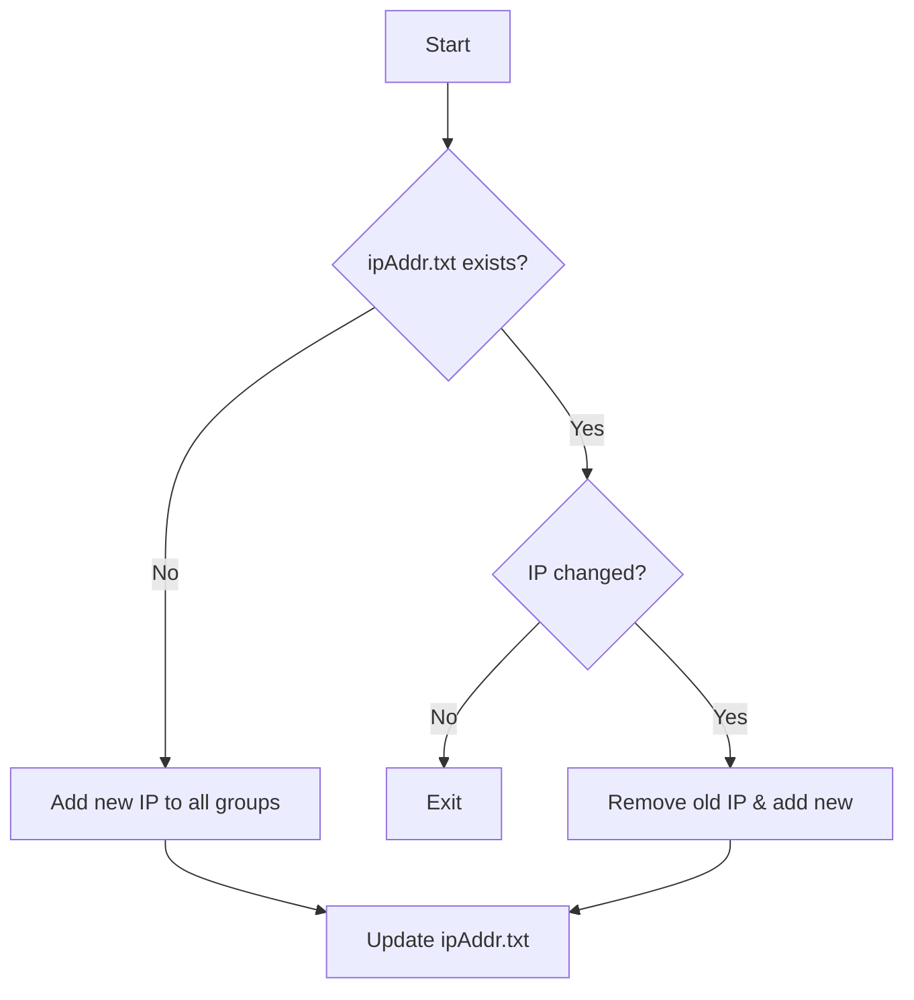

# Alibaba Cloud ECS Dynamic Whitelist Manager

> Automate ECS security group management to handle dynamic public IP changes

## 🎯 Key Features

- **Smart IP Detection**
  Auto-detects current public IP and compares with history
- **Lifecycle Management**
  ✅ Auto-add new IPs
  ✅ Auto-remove old IPs
  ✅ Multi-account batch operations
- **Granular Control**
  - Configurable port ranges (single/range)
  - TCP/UDP protocol selection
  - Allow/deny policy switch


## 📦 Quick Start

### Prerequisites

- Alibaba Cloud AK/SK (requires `AliyunECSFullAccess` permission)
- Go 1.20+ (for source compilation only)

### Installation

#### Binary Install (Recommended)

```bash
# Linux/macOS
wget https://github.com/WillemCode/AliCloud_Whitelist/releases/v1.0.0/download/aliyun-whitelist-linux-amd64 -O /usr/local/bin/aliyun-whitelist
chmod +x /usr/local/bin/aliyun-whitelist
# Windows
Download aliyun-whitelist-windows-amd64.exe
```

#### Build from Source

```bash
git clone https://github.com/WillemCode/AliCloud_Whitelist.git
cd AliCloud_Whitelist
go build -o aliyun-whitelist
```

## ⚙️ Configuration

Create `config.yaml`:

```yaml
aliyun_accounts:
  - name: "Production"
    regionId: "cn-beijing"
    access_key: "AK_****"
    access_secret: "SK_****"
    policy: "accept"
    Port_Range: "22/22"
    Ip_Protocol: "tcp"
    Security_GroupId: "sg-****"
  - name: "Testing"
    regionId: "cn-hangzhou"
    access_key: "AK_****"
    access_secret: "SK_****"
    policy: "accept"
    Port_Range: "80/443"
    Ip_Protocol: "tcp"
    Security_GroupId: "sg-****"
```

## 🚀 Usage

### Normal Execution

```bash
./aliyun-whitelist
```

Process flow:
1. Detect current public IP
2. Compare with `ipAddr.txt` records
3. Auto-update security group rules

### Scheduled Task (Recommended)

```bash
# Run hourly (Linux crontab example)
0 * * * * /usr/local/bin/aliyun-whitelist >> /var/log/whitelist.log 2>&1
```

## 🔍 Workflow



## 📜 Best Practices

1. **Permission Control**: Create dedicated RAM account with `AliyunECSFullAccess` only
2. **Log Management**: Use `logrotate` for log files
3. **High Availability**: Run on multiple office hosts

## 🤝 Contribution

Welcome issues and PRs:
1. Bug reports should include OS version and error logs
2. Feature requests should describe use cases

## 📜 License

Licensed under [GNU GPLv3](./LICENSE).
This means:
- You may copy, modify and distribute this software
- Modified versions must remain under GPL
- Include original copyright and license text
See [LICENSE](./LICENSE) for details. For GPL compliance questions, visit [GNU website](https://www.gnu.org/licenses/).

---

## Star History

[](https://www.star-history.com/#WillemCode/AliCloud_Domain&WillemCode/AliCloud_Whitelist&Date)
