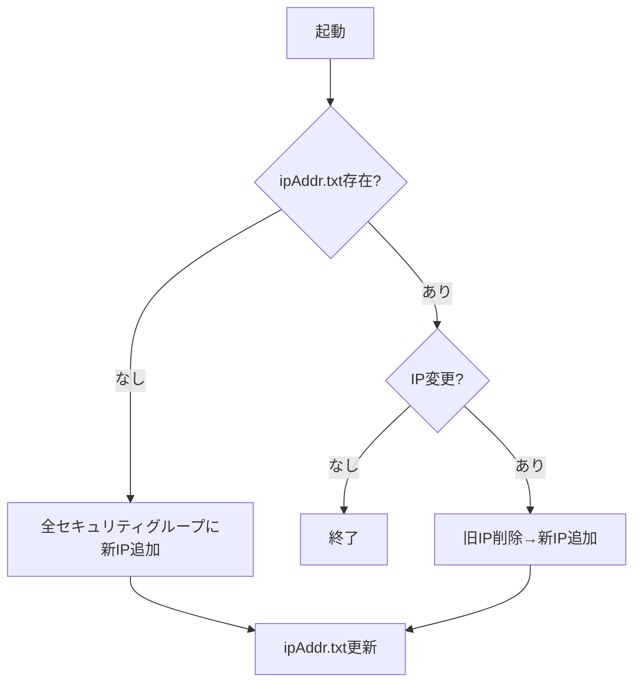

# 阿里雲ECS動的ホワイトリスト管理ツール

> 動的パブリックIP変更による運用課題を解決する阿里雲ECSセキュリティグループ管理ツール

## 🎯 主な機能

- **IP自動検出**
  現在のパブリックIPを自動取得し、履歴と比較
- **ライフサイクル管理**
  ✅ 新規IP自動追加
  ✅ 旧IP自動削除
  ✅ 複数アカウント一括操作
- **詳細設定**
  - ポート範囲設定（単一/範囲）
  - TCP/UDPプロトコル選択
  - 許可/拒否ポリシー設定


## 📦 クイックスタート

### 前提条件

- 阿里雲アカウントのAK/SK（`AliyunECSFullAccess`権限が必要）
- Go 1.20+（ソースからのビルド時のみ）

### インストール方法

#### バイナリインストール（推奨）

```bash
# Linux/macOS
wget https://github.com/WillemCode/AliCloud_Whitelist/releases/v1.0.0/download/aliyun-whitelist-linux-amd64 -O /usr/local/bin/aliyun-whitelist
chmod +x /usr/local/bin/aliyun-whitelist
# Windows
aliyun-whitelist-windows-amd64.exe をダウンロードして実行
```

#### ソースからビルド

```bash
git clone https://github.com/WillemCode/AliCloud_Whitelist.git
cd AliCloud_Whitelist
go build -o aliyun-whitelist
```

## ⚙️ 設定説明

`config.yaml` 設定ファイル:
```yaml
aliyun_accounts:
  - name: "本番環境"
    regionId: "cn-beijing"
    access_key: "AK_****"
    access_secret: "SK_****"
    policy: "accept"
    Port_Range: "22/22"
    Ip_Protocol: "tcp"
    Security_GroupId: "sg-****"
  - name: "テスト環境"
    regionId: "cn-hangzhou"
    access_key: "AK_****"
    access_secret: "SK_****"
    policy: "accept"
    Port_Range: "80/443"
    Ip_Protocol: "tcp"
    Security_GroupId: "sg-****"
```

## 🚀 使用ガイド

### 通常実行

```bash
./aliyun-whitelist
```

処理フロー:
1. 現在のパブリックIPを検出
2. `ipAddr.txt`の記録と比較
3. セキュリティグループルールを自動更新

### 定期実行設定（推奨）

```bash
# 1時間ごとにチェック（Linux crontab例）
0 * * * * /usr/local/bin/aliyun-whitelist >> /var/log/whitelist.log 2>&1
```

## 🔍 動作フロー



## 📜 ベストプラクティス

1. **権限制御**: 専用RAMアカウントを作成し、`AliyunECSFullAccess`権限のみ付与
2. **ログ管理**: `logrotate`でのログローテーションを推奨
3. **高可用性**: 複数オフィス端末での同時実行を推奨

## 🤝 コントリビューション

IssueやPRを歓迎:
1. バグ報告時はOSバージョンとエラーログを記載
2. 新機能提案時は使用シナリオを説明

## 📜 ライセンス

本プロジェクトは  で公開されています。
- ソースコードの自由な複製・改変・再配布が可能ですが、改変版もGPLで公開する必要があります
- 配布時には著作権表示とGPL全文を含め、ソース入手方法を明記してください
詳細は [LICENSE](./LICENSE) ファイルを参照。疑問点がある場合は [GNU公式サイト](https://www.gnu.org/licenses/) を確認するか専門家に相談してください。

---

## Star History

[](https://www.star-history.com/#WillemCode/AliCloud_Domain&WillemCode/AliCloud_Whitelist&Date)
