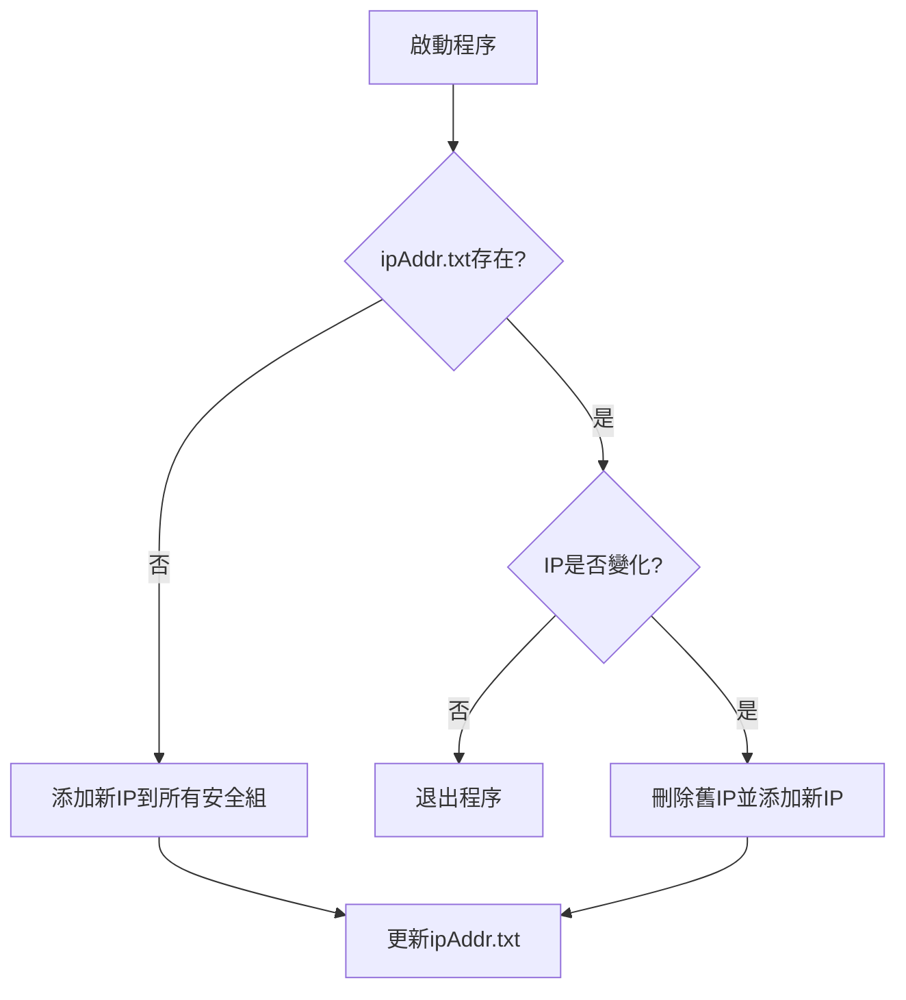

# 阿里雲ECS動態白名單管理工具

> 自動化管理阿里雲ECS安全組白名單，解決動態公網IP變更帶來的運維痛點

## 🎯 功能特性

- **智能IP檢測**
  自動獲取當前公網IP，並與歷史記錄比對
- **全生命週期管理**
  ✅ 自動添加新IP
  ✅ 自動清理舊IP
  ✅ 支援多賬號批量操作
- **精細化控制**
  - 可配置端口範圍（單端口/範圍）
  - 支援TCP/UDP協議選擇
  - 允許/拒絕策略開關


## 📦 快速開始

### 前置要求

- 阿里雲賬號AK/SK（需`AliyunECSFullAccess`權限）
- Go 1.20+（僅源碼編譯需要）

### 安裝方式

#### 二進制安裝（推薦）

```bash
# Linux/macOS
wget https://github.com/WillemCode/AliCloud_Whitelist/releases/v1.0.0/download/aliyun-whitelist-linux-amd64 -O /usr/local/bin/aliyun-whitelist
chmod +x /usr/local/bin/aliyun-whitelist
# Windows
下載 aliyun-whitelist-windows-amd64.exe 執行
```

#### 源碼編譯

```bash
git clone https://github.com/WillemCode/AliCloud_Whitelist.git
cd AliCloud_Whitelist
go build -o aliyun-whitelist
```

## ⚙️ 配置說明

創建 `config.yaml` 配置文件：
```yaml
aliyun_accounts:
  - name: "生產環境"
    regionId: "cn-beijing"
    access_key: "AK_****"
    access_secret: "SK_****"
    policy: "accept"
    Port_Range: "22/22"       # SSH端口示例
    Ip_Protocol: "tcp"
    Security_GroupId: "sg-****"
  - name: "測試環境"
    regionId: "cn-hangzhou"
    access_key: "AK_****"
    access_secret: "SK_****"
    policy: "accept"
    Port_Range: "80/443"     # Web端口範圍
    Ip_Protocol: "tcp"
    Security_GroupId: "sg-****"
```

## 🚀 使用指南

### 常規運行

```bash
./aliyun-whitelist
```

程序將：
1. 檢測當前公網IP
2. 比對`ipAddr.txt`記錄
3. 自動執行安全組規則更新

### 定時任務配置（推薦）

```bash
# 每小時檢查一次（Linux crontab示例）
0 * * * * /usr/local/bin/aliyun-whitelist >> /var/log/whitelist.log 2>&1
```

## 🔍 工作流程



## 📜 最佳實踐

1. **權限控制**：建議創建專用RAM賬號，僅授予`AliyunECSFullAccess`權限
2. **日誌監控**：建議配合`logrotate`管理日誌文件
3. **高可用部署**：可在多台辦公網絡主機同時運行

## 🤝 參與貢獻

歡迎提交Issue或PR：
1. 報告BUG請包含操作系統版本和錯誤日誌
2. 新功能建議請描述使用場景

## 📜 開源協議

本項目採用 [GNU通用公共許可證 (GPL)](./LICENSE) 進行開源發布。
這意味著：
- 你可以自由複製、修改和分發本項目的源代碼，但修改後的項目也必須繼續以 GPL 或兼容的許可證進行發布；
- 分發或發布時，需包含本項目的原始版權聲明與 GPL 協議文本，並提供完整的源代碼獲取方式。
請參閱 [LICENSE](./LICENSE) 文件獲取詳細條款。若你對 GPL 的使用及合規性有任何疑問，請查閱 [GNU 官網](https://www.gnu.org/licenses/) 或諮詢相關專業人士。

---

## Star History
[](https://www.star-history.com/#WillemCode/AliCloud_Domain&WillemCode/AliCloud_Whitelist&Date)
